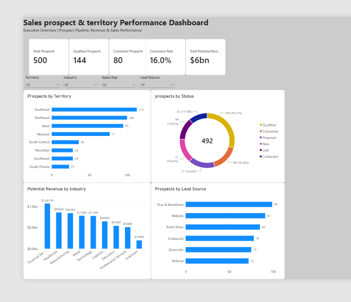
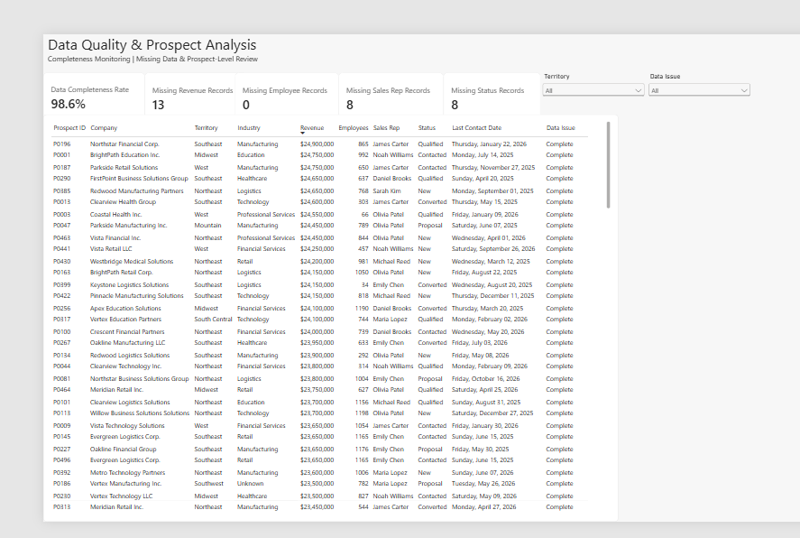

# Sales Prospect & Territory Performance Dashboard

A Power BI portfolio project analyzing sales prospect performance, territory distribution, potential revenue, lead sources, conversion performance, and data quality.



## Project Overview

This project transforms a raw sales prospect dataset containing 500 records into an interactive Power BI dashboard designed to support sales performance analysis and data-quality monitoring.

The report provides an executive-level view of the sales prospect pipeline while also allowing users to identify incomplete records that may require additional review.

## Tools & Technologies

- Power BI Desktop
- Power Query
- DAX
- Microsoft Excel
- GitHub

## Dataset

The dataset contains 500 sales prospect records with information including:

- Prospect ID
- Company
- State
- Territory
- Industry
- Revenue
- Employees
- Lead Source
- Sales Rep
- Status
- Created Date
- Last Contact Date

## Data Cleaning & Transformation

Power Query was used to prepare the raw dataset before analysis.

Key transformations included:

- Standardized inconsistent territory names
- Standardized lead source values
- Replaced missing industry values with `Unknown`
- Converted Excel serial date values into proper date fields
- Assigned appropriate data types
- Reviewed missing values across key business fields
- Preserved missing values where appropriate for data-quality analysis

Examples of standardized values include:

- `Mid West` → `Midwest`
- `N. East` → `Northeast`
- `southeast` → `Southeast`
- `D&B` → `Dun & Bradstreet`

## DAX Measures

Several DAX measures were created to calculate business KPIs and data-quality metrics.

```DAX
Total Prospects =
DISTINCTCOUNT('Sales Prospects'[Prospect ID])
```

```DAX
Qualified Prospects =
CALCULATE(
    [Total Prospects],
    'Sales Prospects'[Status] = "Qualified"
)
```

```DAX
Converted Prospects =
CALCULATE(
    [Total Prospects],
    'Sales Prospects'[Status] = "Converted"
)
```

```DAX
Conversion Rate =
DIVIDE(
    [Converted Prospects],
    [Total Prospects],
    0
)
```

```DAX
Total Potential Revenue =
SUM('Sales Prospects'[Revenue])
```

```DAX
Data Completeness Rate =
VAR TotalRequiredValues = [Total Prospects] * 4
VAR TotalMissingValues =
    [Missing Revenue Records] +
    [Missing Employee Records] +
    [Missing Sales Rep Records] +
    [Missing Status Records]
RETURN
    DIVIDE(
        TotalRequiredValues - TotalMissingValues,
        TotalRequiredValues,
        0
    )
```

A calculated column was also created to identify records requiring review:

```DAX
Data Issue =
IF(
    ISBLANK('Sales Prospects'[Revenue]) ||
    ISBLANK('Sales Prospects'[Employees]) ||
    ISBLANK('Sales Prospects'[Sales Rep]) ||
    ISBLANK('Sales Prospects'[Status]),
    "Needs Review",
    "Complete"
)
```

## Dashboard Pages

### 1. Executive Overview

The Executive Overview provides high-level sales prospect KPIs and interactive analysis by territory, status, industry, lead source, and sales representative.

Key KPIs include:

- **500** Total Prospects
- **144** Qualified Prospects
- **80** Converted Prospects
- **16.0%** Conversion Rate
- Approximately **$6B** in Total Potential Revenue

Interactive slicers allow users to filter the dashboard by Territory, Industry, Sales Rep, and Lead Source.

### 2. Data Quality & Prospect Analysis



This page monitors dataset completeness and provides a prospect-level review table.

Data-quality KPIs include:

- **98.6%** Data Completeness Rate
- **13** Missing Revenue Records
- **0** Missing Employee Records
- **8** Missing Sales Rep Records
- **8** Missing Status Records

Records are classified as either `Complete` or `Needs Review`, allowing users to quickly identify incomplete prospect information.

## Key Insights

- The **Southeast** contains the largest number of prospects with **113** records.
- **Qualified** is the largest prospect status category with **144** prospects.
- **Financial Services** represents the largest potential revenue opportunity at approximately **$1.07B**.
- **Dun & Bradstreet** is the largest lead source with **99** prospects.
- The overall conversion rate is **16.0%**.
- Overall data completeness is **98.6%**, with missing revenue, sales representative, and status information representing the primary data-quality issues.

## Skills Demonstrated

This project demonstrates experience with:

- Data cleaning and transformation with Power Query
- Data-quality assessment
- DAX measures and calculated columns
- Filter context and `CALCULATE`
- `DISTINCTCOUNT`, `DIVIDE`, `VAR`, and conditional logic
- KPI development
- Interactive slicers and cross-filtering
- Dashboard layout and visual design
- Sales and territory analysis
- Prospect-level data validation
- Communicating analytical findings through Power BI

## Repository Files

- `Sales_Prospect_Performance_Dashboard.pbix` — Completed Power BI report
- `Sales_prospects.xlsx` — Source dataset
- `images/executive-overview.png` — Executive dashboard preview
- `images/data-quality-prospect-analysis.png` — Data-quality dashboard preview

## About This Project

This project was created as part of my data analytics portfolio to demonstrate the process of transforming raw business data into an interactive analytical dashboard, from data preparation and quality assessment through DAX calculations, visualization, and business insight generation.
